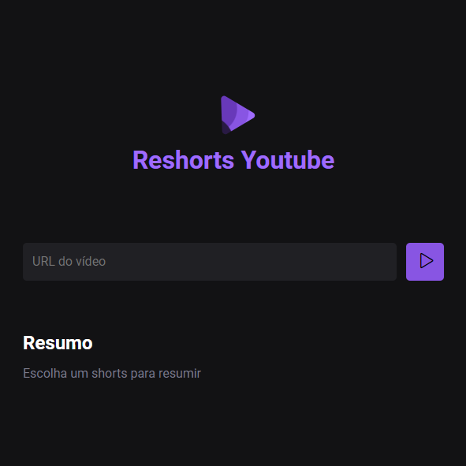

<h1 align="center"> Reshorts Youtube </h1>

Desenvolvido por Guilherme de Carvalho Estudante de Análise e Desenvolvimento de Sistemas  FATEC -Bragança Paulista  

## 🚀 Tecnologias

Esse projeto foi desenvolvido com as seguintes tecnologias:

- HTML
- CSS
- JavaScript
- NodeJS
- Inteligência Artificial

## 💻 Projeto

O Reshorts Youtube é uma aplicação web que utiliza inteligência artificial para criar resumos de vídeos shorts do Youtube, transcrever e resumir o conteúdo dos vídeos.
###

## :memo: Licença

Esse projeto está sob a licença MIT.

  

Feito com ♥ por Guilherme de Carvalho :wave: 

